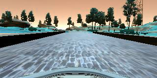
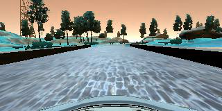

# Data Collection

I used the set provided by Udacity as a baseline for testing out my network
architecture. However I found that while the data did great on straight roads,
it performed poorly on curves. Because of this I got a lot more samples doing
error correction. I found that my network performed much better the more error
correction samples that I got. In addition to this, I also flipped the images
so that the amount of data was effectively doubled. I found that my network
trained much faster when I reduced the size of my image, so I reduced it to
32x64 and found it did not hurt performance much. In total it ended up being
about ~19,000 images.

 

# Network Architecture
The network I chose was a CNN. The first thing the network did was normalize
the data. From here it did two convolutional layers, each followed by a RELU
activation. The convolutions were 5x5 and had a stride of 2. Next it was
followed by a dropout layer of 0.2. From here there were 5 fully connected
layers, each followed by a RELU activation. There was a dropout layer of 0.5
inbetween the first two fully connected layers. The sizes of the fully
connected layers were 256, 128, 64, 32, and 1.

# Training
I used the Adam optimizer with an intial loss of 0.0001. I also chose an epoch
size of 5. The loss function I used was mean squared error.

# Test and Validation Sets
After collecting all the data I first randomized it. From here I took 30% of
the data for testing and validation. I then split this in half, making it 15%
for testing and validation.

The validation loss and accuray where 0.0238 and 0.5741 while the test were
0.0244 and 0.5928.

# Thoughts, Future Improvements
While the car did not go off the road, it would still be a scary ride from a
passengers point of view. It was swerving inbetween lanes and will not
generalize to other environments. I think the model could continued to be
improved by making use of transfer learning using something like VGG and
AlexNet. This would allow me to train a much more sophisticated network as
training from scratch is very slow on my laptop.
